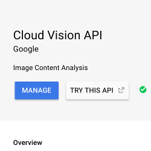
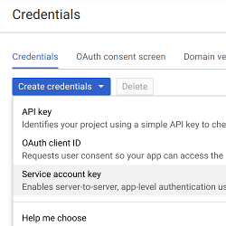
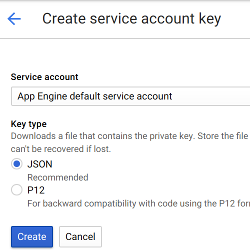

# Google Cloud Vision

[Google Cloud Vision](https://cloud.google.com/vision/) enables developers to understand the content of an image by encapsulating powerful machine learning models in an easy-to-use REST API. This allows Drupal to use the Google Cloud Vision API across the site.

## Features

- Ensures uploaded images uploaded with image fields do not contain adult content
- Saves Google Vision Keys safely through [Lockr](https://www.drupal.org/project/lockr)

## Dependencies

- [Key](https://www.drupal.org/project/key)
- [Lockr](https://www.drupal.org/project/lockr)

## Install

1. Visit the [Google Cloud Vision API](https://console.cloud.google.com/apis/library/vision.googleapis.com) and enable the API

    
    
2. Head over to the [Google Cloud Console Service Account Credentials](https://console.cloud.google.com/apis/credentials) and [create an API key](https://cloud.google.com/docs/authentication/api-keys#creating_an_api_key)

    
    
3. Create the JSON service key

    
    
4. In `/admin/config/system/keys`, add a new key named "google", and enter in the JSON service account key you acquired
5. Install the Google Cloud Vision module as you would [install any Drupal 8 module](https://www.drupal.org/docs/8/extending-drupal-8/installing-drupal-8-modules).
6. Enable the Google Cloud Vision module.
7. Visit `/admin/config/google-cloud-vision/settings` and set both a:
    - Key Machine Name: This is the name of the key that will be used in the [Key](https://www.drupal.org/project/key) module. You had used "google" for this.
    - Google Project ID: This is the name of the application that will be used on the Google Cloud Vision side
8. Visit `/google-cloud-vision/demo` and ensure Google Cloud Vision is functioning properly.

## Usage

Once the module is installed and configured properly, uploading an image to an image field will have Google Cloud Vision check the image securely.
